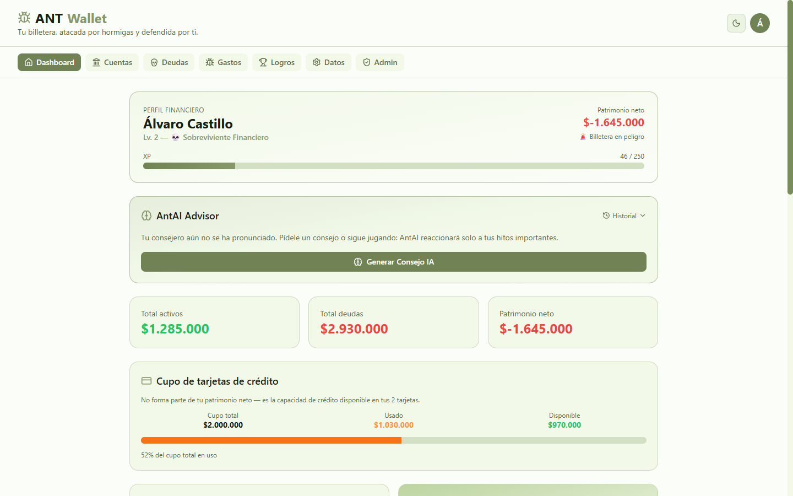
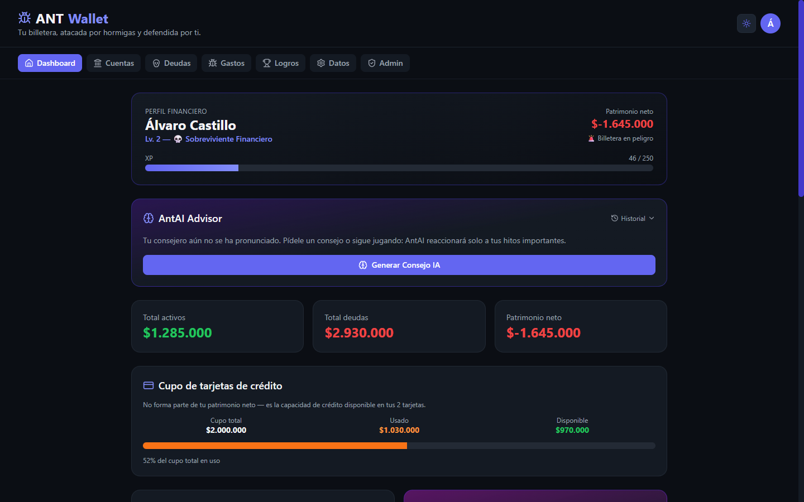
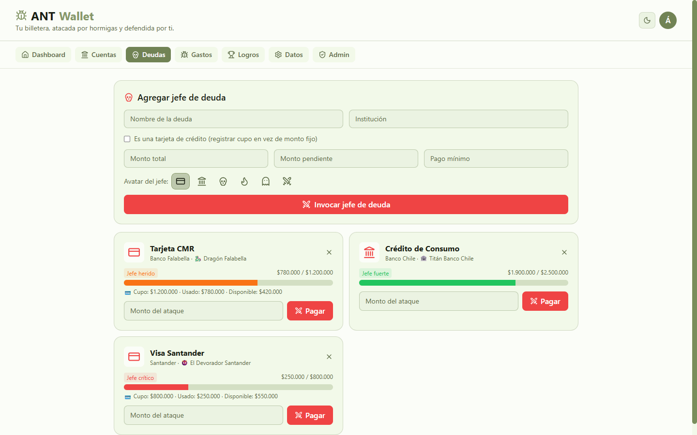
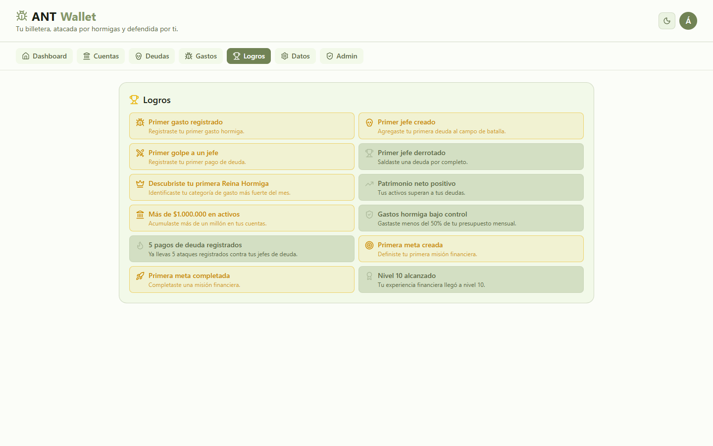
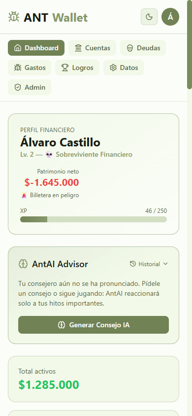
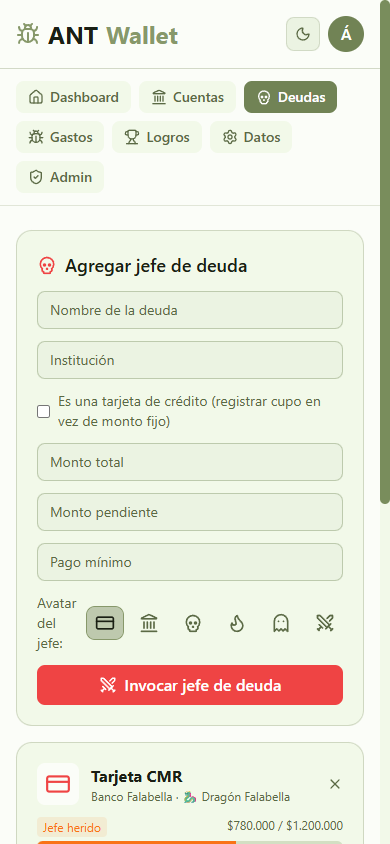
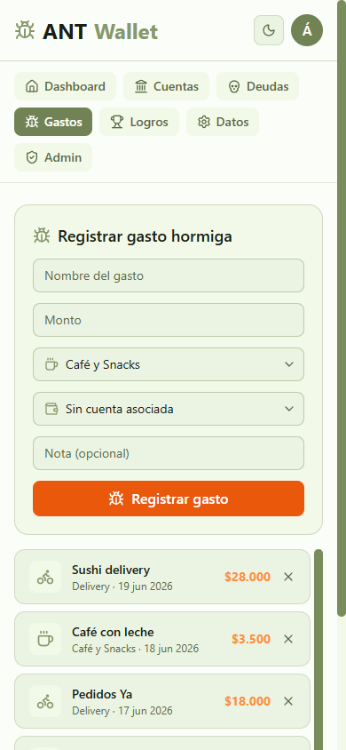

# 🐜 ANTWallet

**Un RPG financiero personal — finanzas gamificadas con IA generativa, hecho
de punta a punta con React, Firebase y OpenAI.**

[](https://github.com/AlvaroCC96/ANTWallet/actions/workflows/deploy.yml)
🔗 **[Demo en vivo](https://alvarocc96.github.io/ANTWallet/)** ·
👤 [AlvaroCC96](https://github.com/AlvaroCC96)

> Proyecto personal construido para uso real (llevo mis propias finanzas
> ahí), y documentado como portafolio. Si estás leyendo esto en una
> entrevista o revisando mis proyectos: abajo explico qué hace, cómo está
> construido y qué decisiones tomé y por qué.

---

## ¿Qué es?

ANTWallet convierte el seguimiento de gastos personales en un mini-juego
RPG: los gastos pequeños e impulsivos ("gastos hormiga") atacan tu
billetera, las deudas son jefes con barra de vida que derrotas pagando, y
subes de nivel acumulando buenas decisiones financieras. Tiene su propio
backend (Firebase), su propio sistema de autenticación y control de acceso
por invitación, y un consejero con IA generativa que comenta tu progreso.

No es una maqueta — es la app que uso para llevar mis cuentas reales.

## 📸 Capturas

<table>
<tr>
<td width="50%">

**Dashboard (claro)**


</td>
<td width="50%">

**Dashboard (oscuro)**


</td>
</tr>
<tr>
<td width="50%">

**Deudas como jefes RPG**


</td>
<td width="50%">

**Logros**


</td>
</tr>
</table>

<table>
<tr>
<td width="33%">

**Mobile — Dashboard**


</td>
<td width="33%">

**Mobile — Deudas**


</td>
<td width="33%">

**Mobile — Gastos**


</td>
</tr>
</table>

## 🎮 Funcionalidades

- **Dashboard RPG**: nivel, XP, título financiero (ej. "Defensor de
  Billetera", "Sobreviviente Financiero"), patrimonio neto, vida de la
  billetera, Reina Hormiga del mes y jefe de deuda principal — todo
  derivado del mismo estado, sin lógica duplicada.
- **Deudas como jefes finales**: nombre RPG generado automáticamente según
  la institución (ej. "Banco Falabella" → "Dragón Falabella"), barra de
  vida, estados (fuerte / herido / crítico / derrotado), daño flotante al
  pagar y modal de victoria al saldar la deuda.
- **Tarjetas de crédito**: cupo total, usado y disponible por tarjeta y
  agregado, separado explícitamente del patrimonio neto.
- **Gastos hormiga**: registro rápido con categorías, hormiga animada
  cruzando la pantalla, y "shake" de billetera en gastos grandes.
- **Misiones y logros**: metas financieras con progreso (fondo de
  emergencia, viajes, etc.) y 12 logros desbloqueables con su propio
  registro de fecha real.
- **Timeline financiero**: línea de tiempo de toda tu actividad (gastos,
  pagos, cuentas, metas, logros) ordenada por fecha.
- **🧠 AntAI Advisor**: un consejero con IA generativa (OpenAI vía Firebase
  Cloud Functions) que reacciona solo a hitos importantes — subir de
  nivel, derrotar un jefe, cambiar la Reina Hormiga, completar una meta,
  cruzar un hito de patrimonio, o gastar de más — y que también puedes
  invocar manualmente. Ver la sección dedicada más abajo.
- **Multiusuario real con acceso por invitación**: login solo con Google,
  sin contraseñas. Un panel de administrador decide quién entra; todo lo
  demás (Firestore, Cloud Functions) refuerza ese control server-side.
- **Modo claro/oscuro**: paleta completa basada en variables CSS, sin
  duplicar componentes.
- **Exportar/importar**: CSV de gastos y backup completo en JSON.

## 🛠️ Stack

| Capa | Tecnología | Por qué |
|---|---|---|
| UI | React + TypeScript + Vite | DX rápido, tipado estricto de punta a punta |
| Estilos | TailwindCSS + variables CSS | Theming claro/oscuro sin duplicar clases por componente |
| Animación | Framer Motion | Daño flotante, barras de vida, transiciones de logros |
| Auth | Firebase Authentication (Google SSO) | Sin contraseñas que gestionar ni filtrar |
| Datos | Firebase Firestore | Tiempo real, por usuario, reglas de seguridad declarativas |
| Backend de IA | Firebase Cloud Functions (Node 20, v2) | La API key de OpenAI nunca toca el cliente |
| IA generativa | OpenAI (Chat Completions, JSON mode) | Insights narrativos a partir de datos agregados, nunca crudos |
| CI/CD | GitHub Actions → GitHub Pages | Deploy automático en cada push a `main` |
| Iconografía | lucide-react | Consistente en ambos temas, sin depender de emojis Unicode |

## 🧠 Decisiones de arquitectura (para los curiosos)

Algunas cosas que vale la pena explicar si te interesa cómo está pensado,
no solo qué hace:

- **Todo el estado de juego es derivado, no event-sourced.** El XP, el
  nivel, los logros y el patrimonio se calculan en cada render a partir del
  estado actual de Firestore (cuentas, deudas, gastos, metas) — no hay un
  log de transacciones financieras paralelo. Esto simplifica mucho la
  lógica (un logro o un nivel "es verdad" mientras la condición se cumpla,
  no hay que sincronizar dos fuentes), con el costo consciente de que
  borrar un dato retroactivamente puede bajar tu nivel. Donde sí necesitaba
  un historial real (fecha exacta de un logro desbloqueado), agregué un
  log mínimo y específico (`unlockedAchievements`) en vez de event-sourcing
  completo.
- **Theming con variables CSS, no con clases `dark:` repetidas.** Los
  tokens de color (`card`, `accent`, `ink`, `muted`, etc.) están definidos
  como variables CSS en `:root` y `.dark`, y Tailwind los referencia vía
  `rgb(var(--x) / <alpha-value>)`. Cambiar de tema es una clase en
  `<html>`, no un re-render de cientos de `className`.
- **La IA nunca ve datos crudos.** `buildFinancialSnapshot()` reduce todo
  el estado financiero a un resumen de ~12 números agregados (patrimonio,
  nivel, nombre del jefe principal, etc.) antes de que llegue a la Cloud
  Function. Ni transacciones individuales, ni nombres de cuentas, ni saldos
  por separado.
- **Seguridad replicada en dos capas independientes.** El control de
  acceso (admin + allowlist) vive en `firestore.rules` para Firestore, y se
  vuelve a verificar dentro de la Cloud Function con el Admin SDK — porque
  una función "callable" de Firebase es necesariamente un endpoint público
  a nivel de red (así está diseñado el producto); la seguridad real tiene
  que vivir en el código de la función, no en el IAM de Cloud Run.
- **Deploy de doble pista.** `npm run deploy` para publicar a mano, y un
  workflow de GitHub Actions que hace lo mismo automáticamente en cada push
  a `main` usando secrets del repositorio — así nunca hay que recordar
  correr el comando.

## 🚀 Probarlo localmente

### Requisitos

- Node.js 18+
- Un proyecto de Firebase propio (plan gratuito Spark es suficiente para
  todo excepto AntAI Advisor)

### 1. Clonar e instalar

```bash
git clone https://github.com/AlvaroCC96/ANTWallet.git
cd ANTWallet
npm install
```

### 2. Crear tu propio proyecto de Firebase

ANTWallet no trae credenciales — cada quien conecta su propio backend.

1. Ve a [console.firebase.google.com](https://console.firebase.google.com) →
   **Agregar proyecto**.
2. **Authentication → Get started → Sign-in method**: habilita **Google**
   (es el único proveedor que usa la app).
3. **Firestore Database → Create database**: elige **Start in production
   mode**. Luego, en la pestaña **Rules**, pega el contenido de
   [`firestore.rules`](firestore.rules) y publica.
4. En la página principal del proyecto, agrega una app **Web** (ícono `</>`)
   y copia el objeto `firebaseConfig` que te entrega.

### 3. Variables de entorno

```bash
cp .env.example .env
```

Completa `.env` con los valores de `firebaseConfig` del paso anterior. Este
archivo nunca se sube a git.

### 4. Definir tu cuenta como administrador

En [`src/config/admin.ts`](src/config/admin.ts) y en la función `isAdmin()`
de [`firestore.rules`](firestore.rules), reemplaza el correo por el tuyo. El
admin siempre tiene acceso y aprueba a otras cuentas desde el panel
**Admin** dentro de la app.

### 5. Correr en desarrollo

```bash
npm run dev
```

## 📦 Build y despliegue

```bash
npm run build      # build de producción
npm run preview    # previsualizarlo localmente
```

El proyecto está configurado para **GitHub Pages** de dos formas:

- **Automático** (recomendado): cada push a `main` dispara
  [`.github/workflows/deploy.yml`](.github/workflows/deploy.yml), que
  compila y publica `dist/` en la rama `gh-pages`. Requiere los 6 secrets
  `VITE_FIREBASE_*` configurados en **Settings → Secrets and variables →
  Actions**.
- **Manual**: `npm run deploy` hace lo mismo desde tu máquina, usando tu
  `.env` local.

Antes de la primera vez (cualquiera de los dos métodos):

- Ajusta `base` en [`vite.config.ts`](vite.config.ts) y `homepage` en
  [`package.json`](package.json) si tu repo o usuario son distintos.
- Agrega tu dominio de GitHub Pages en **Firebase → Authentication →
  Settings → Authorized domains**.
- En GitHub, en **Settings → Pages**, confirma que la fuente sea la rama
  `gh-pages`.

## 🔐 Acceso y seguridad

- **Login exclusivo con Google** — sin contraseñas que filtrar ni recuperar.
- **Acceso por invitación**: solo el administrador y las cuentas que él
  habilite desde el panel **Admin** pueden entrar.
- **Aislamiento real de datos**: cada usuario tiene su propio documento en
  Firestore (`users/{uid}`), reforzado por reglas de seguridad — no solo
  por el código del frontend.

## 🧠 AntAI Advisor (opcional)

Un consejero financiero con IA generativa integrado al RPG: nunca calcula
montos ni modifica datos, solo interpreta un resumen y genera mensajes
narrativos. Es **opcional** — el resto de la app funciona perfecto sin
configurarlo, y si la función no está desplegada, muestra un mensaje local
("el oráculo está descansando") en vez de romperse.

<details>
<summary><strong>Cómo activarlo (requiere plan Blaze de Firebase + API key de OpenAI)</strong></summary>

### Requisitos

1. **Plan Blaze en Firebase** (pago por uso) — las Cloud Functions
   necesitan salir a internet para llamar a OpenAI, y eso requiere el plan
   de pago. Capa gratuita generosa; el costo real para este volumen es
   mínimo.
2. **Una API key de OpenAI** — [platform.openai.com](https://platform.openai.com/api-keys).
   Nunca va en el frontend; vive solo en Firebase Secret Manager.

### Pasos

```bash
cd functions
npm install
npx firebase-tools login
npx firebase-tools use --add          # elige tu proyecto
npx firebase-tools functions:secrets:set OPENAI_API_KEY
npm run build
npx firebase-tools deploy --only functions
```

Por defecto usa el modelo `gpt-4o-mini`. Para cambiarlo sin tocar código,
crea `functions/.env` (no se sube a git) con `OPENAI_MODEL=otro-modelo`.

> **Nota de IAM**: en proyectos de Google Cloud nuevos, el primer deploy de
> una Cloud Function v2 puede fallar por dos motivos comunes — (1) falta el
> rol "Cloud Build Service Account" en la cuenta de servicio de Compute
> Engine (`PROJECT_NUMBER-compute@developer.gserviceaccount.com`), o (2) el
> servicio de Cloud Run creado no permite invocaciones públicas (`allUsers`
> con rol "Cloud Run Invoker"). Ambos se arreglan desde IAM / Cloud Run en
> la consola de Google Cloud, una sola vez.

### Cómo probar cada parte

- **Generación manual**: en el Dashboard, card "AntAI Advisor" → "Generar
  Consejo IA".
- **Eventos automáticos**: sube de nivel, paga una deuda hasta $0, completa
  una meta, o supera el 80% del presupuesto mensual — cada uno dispara un
  insight solo, una sola vez por evento (queda registrado en
  `aiWatcherState`).
- **Fallback local**: sin la función desplegada, "Generar Consejo IA"
  muestra un mensaje local en vez de romperse.
- **Historial**: hasta los últimos 20 consejos, con opción de limpiarlo.

### Seguridad

- La API key vive en Firebase Secret Manager, nunca en el frontend ni en
  el repo.
- La función valida que quien llama esté autenticado y en la allowlist
  (mismo control de acceso que el resto de la app, replicado server-side).
- Solo se envía un `FinancialSnapshot` con montos agregados — nunca gastos
  individuales ni nombres de cuentas reales.

</details>

## 🗂️ Estructura del proyecto

```
src/
  components/          UI: formularios, listas, dashboard, gamificación
  components/auth/      pantallas de login y acceso denegado
  components/admin/     panel de administración de usuarios permitidos
  components/rpg/       perfil RPG, misiones, timeline, logros
  components/ai/        AntAI Advisor: card, historial, watcher de eventos
  store/                 AuthContext, AppContext (Firestore), FxContext, ThemeContext
  hooks/                 useAIAdvisor
  lib/                   inicialización de Firebase + cliente de Cloud Functions
  utils/                 calculations, rpg, achievements, missions, timeline,
                         bossNames, creditCards, snapshot, aiEventDetector
  types/                 modelos de datos, tipos RPG y de IA
  data/                  categorías, datos demo, mensajes, eventos de IA
firestore.rules           reglas de seguridad por usuario y allowlist de acceso
functions/                Firebase Cloud Functions (generateFinancialInsight)
.github/workflows/        CI/CD: deploy automático a GitHub Pages
```

## 🗺️ Posibles próximos pasos

- Code-splitting más agresivo (el SDK de Firebase domina el bundle inicial).
- Log de eventos persistente más completo, para timeline con fechas exactas
  de cada logro y feedback de XP en tiempo real desde el día uno.
- Soporte multi-moneda.
- Tests automatizados (hoy la validación es manual + TypeScript estricto).

---

Hecho por [AlvaroCC96](https://github.com/AlvaroCC96) — porque las hormigas
siempre encuentran la forma de llegar a tu billetera.
